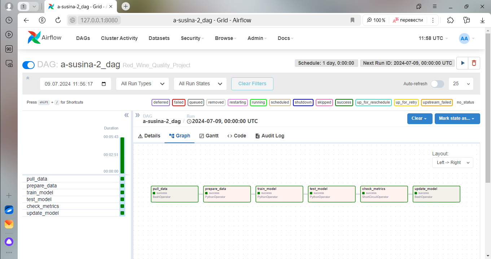
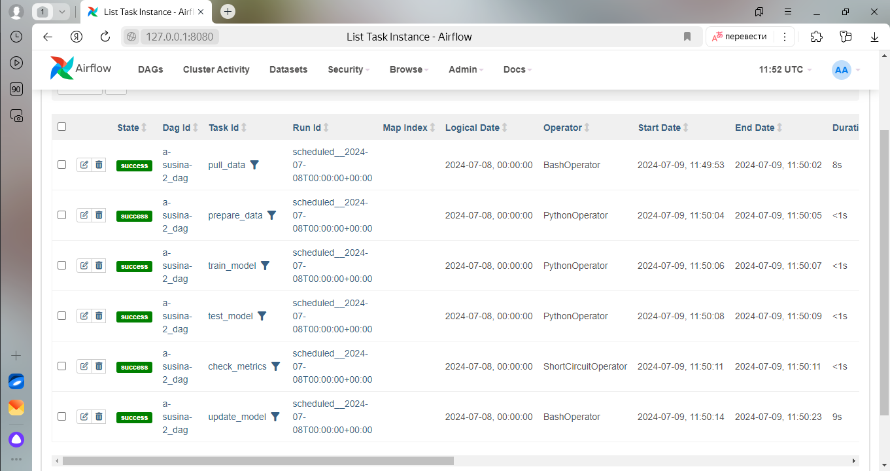

# MLOps Lesson7 Final Project  
- cоздан новый не приватный репозиторий
- cозданы ветки master и develop
Разработка ведётся только в ветке develop.  
## Первый коммит.
### Настройка проекта. Работа с git и dvc.    
- проект проинциализирован git командой git init 
- установлено py -m venv .venv и активировано виртуальное окружение ./.venv/Scripts/activate (Windows)
- установлены библиотеки dvc, dvc-s3 и настроен локальный config.local (с ключами доступа) и .dvc/config
- настроены файлы .dvc/.gitignore .gitignore, чтобы не попали секретные ключи ни в git, ни в dvc
- проект локально разрабатывается на Windows, для пользователей MacOS следует системный файл ".DS_Store" добавить и в файл .gitignore и .dvcignore (на данном  шаге не добавлен в силу операционной системы)
- установлены необходимые библиотеки, включая библиотеку для работы с MinIO
- по мере развития проекта залитый в репозиторий файл requirements.txt будет изменяться
### Работа с данными. Версионирование данных.
- скачены данные по [ссылке](https://github.com/aniruddhachoudhury/Red-Wine-Quality/blob/master/winequality-red.csv)
- в проекте создана папка data, в которую помещены скаченные данные, файл с названием winequality-red.csv
- добавлены данные в виде csv файла в DVC командой dvc add data (папка с файлом данных)
- теперь версионирование данных осуществляется из DVC (файл data.dvc)
## Второй коммит.
### Обоснованный выбор моделей.
- выбраны две модели классификации среди моделей машинного обучения для задачи классификации 'LogisticRegression', 'RandomForestClassifier', 'DecisionTreeClassifier', 'GradientBoostingClassifier', 'KNeighborsClassifier'
- в качестве метрики выступили accuracy, f1_score, roc_auc
- ноутбук с экпериментом и описанием выбора моделей находится по пути ./notebooks/Models selection experiment.ipynb (запускался в среде разработки PyCharm с установленной библиотекой jupyter)
- результатом выбора оказались две модели: 'RandomForestClassifier' - у этой модели хорошее качество на тесте, надо модель дообучить избегая переобучения и 'LogisticRegression' - у неё метрики на тесте и трейне не отличаются, нужно повышать качество
### Код обучения моделей.
- скрипт по обучению моделей 'RandomForestClassifier' и 'LogisticRegression' находится по пути ./src/learn_models.py  
- код обучения моделей выполнен без трекинга и оркестрации, проверен локально
- по пути ./src/logs находятся логи запуска кода обучения выбранных моделей с вычисленными метриками для обоих моделей
- по пути ./src/pkls находятся сохранённые локально модели в виде *.pkl файлов
## Третий коммит.
### Выбор инструмента трекинга эскпериментов.
- в качестве инструмента трекинга эксперимента выбран ClearML, имеет возможности и облачной и локальной разработки
- выбран облачный вариант сервиса с инициализацией clearml-init
- обновлён файл requirements.txt
### Выбор метрики качества для логирования.
- в качестве метрики выбраны: "Accuracy", "F1_score", "ROC_AUC"
- в ./src/config.py находится словарь с выборочными гиперпараметрами (включая random_seed) для [RandomForestClassifier](https://scikit-learn.org/stable/modules/generated/sklearn.ensemble.RandomForestClassifier.html) и [LogisticRegression](https://scikit-learn.org/stable/modules/generated/sklearn.linear_model.LogisticRegression.html) 
- пенальти 'l2' подходит для всех решателей для мультиклассовой классификации, поэтому фиксируем в ./src/config.py
- другие гиперпараметры перебираются в цикле для каждого из task (ClearML)
### Эксперименты в ClearML.
#### RandomForestClassifier
Интересуют эксперименты с лучшими метриками на тестовой выборке и с минимальной разницей на тренировочной и тестовой выборках
- RFC_test_N: [Лучшие показатели на тестовой выборке и гиперпараметры](https://app.clear.ml/projects/7d2ed3b74d4d424dbf06f1aef723d447/experiments/0e923afe0ce3442b926161a221a5cf1b/output/execution)
- RFC_train_N: [Лучшие показатели на тренировочной выборке и гиперпараметры](https://app.clear.ml/projects/7d2ed3b74d4d424dbf06f1aef723d447/experiments/34b852545e0148a3aabc15cc282d97d7/output/execution)
 
(N - номер эксперимента для RFC с наилучшими гиперпараметрами, N одинаков и для теста и для трейна)

#### LogisticRegression
Интересует эксперимент с наилучшей метрикой на тестовой выборке
- LR_test_K: [Лучшие показатели на тестовой выборке и гиперпараметры](https://app.clear.ml/projects/7d2ed3b74d4d424dbf06f1aef723d447/experiments/b4e221fc640e4c3fafb9728dca36ab85/output/execution)  (высокий  f1-score и при этом высокий ROC-AUC среди подобных экспериментов)
 
(K - номер эксперимента для LR с наилучшими гиперпараметрами)

Выбор за логистической регрессией, поскольку не уступает при найденных параметрах случайному лесу, но данная модель более легковесная и шустрая. Выбраны параметры, где и f1-score и ROC-AUC одновременно имеют высокие показатели.
Все модели сохранены на данном шаге локально, имеют тот же номер, что и в ClearML. В гит модели не залиты (тем более лучшие).
По всем моделям локально ведутся логи в файл: ./logs/tracking_model_metrics.log (в гит не залиты)
## Четвёртый коммит.
### Пайплайн обучения модели (LogisticRegression).
- добавлен DAG - ежедневный запуск обучения модели в Airflow
- сервер Airflow поднимается локально в Windows с помощью файла docker-compose.yaml
- подгружаемые в контейнер докера библиотеки прописаны в Dockerfile
- параметры модели передаются из стороннего конфига (src/config.py)
- модель и метрики хранятся в MinIO и передаются с помощью dvc во время выполнения dag
- дополнительно предусмотрен чекер, который проверяет хеш-сумму *.dvc (на данном этапе в пайплайн не включен)
- работа с гит: папка с логами запуска DAG в Airflow /logs (в корне проекта) не попадает в гит (за это отвечает файл .gitignore в корне проекта), также не попадает в гит модель и метрики (только .dvc файлы), за это отвечают соответствующие .gitignore файлы
### Результаты выполнения DAG.
- cхема пайплайна, в AIRFLOW

- пайплайн AIRFLOW в виде таблицы:

На изображениях представлены шесть этапов обучения выбранной модели LogisticRegression:
- pull_data (загрузка данных из s3)
- prepare_data (разбивка датасета на train и test)
- train_model (обучение на трейне и сохранение модели)
- test_model (проверка обученной модели на тесте, получение новых метрик)
- check_metrics (сравнение метрик)
- update_model (обновление  модели в MinIO)
## Пятый коммит.
### Подключение API к проекту
- для реализации схемы Real-time развертывания использован веб-фреймворк FastAPI
- созданы четыре эндпоинта /predict, /liveness, /readiness и /healthcheck
- в качестве приложения, отправляющие POST-запросы служит streamlit, вызывается отдельной функцией  streamlit run ./front/front.py из корня проекта
- в процессе работы API из хранилища MinIO подтягивается актуальная модель
### Работа с git
- перед финальным степом добавлен файл .env_example с переменными окружения без заданных аргументов
## Шестой коммит.
### Архитектура приложения
- приложение api.py, которое покрывается тестами, переименовано в app.py и перенесено в пакетную папку src/api
- перенос приложения в другую папку создаёт архитектуру приложения, на функциональность не влияет, поскольку библиотека uvicorn для запуска веб-сервера и streamlit работают с портами
### CI пайплайн
- добавлен в проект CI пайплайн, состоящий из трёх основных этапов: линтест, доступность данных и доступность модели для загрузки с помощью DVC, Unit-тест на проверку функциональности приложения src/api/app.py с использованием pytest при доступности модели
- проверки запустятся автоматически во время merge request в основную ветку
- для работы пайплайна созданы переменные CI/CD, секретный ключ доступа к MinIO дополнительно замаскирован
###  Merge request в основную ветку
- все тесты предварительно прошли проверку в тестовом режиме 
- merge request выполняется в основную ветку, при этом проверки запускаются автоматически во время merge request в основную ветку
- добавлена возможность интеграционного теста
- до слияния develop ветки с основной (условия, что merge request прошел все стадии проверки) default protected остаётся с первоначальным коммитом (пустой)
- после прохождения всех тестов и любых дополнительных условий, произойдёт слияния ветки develop в основную, выбрана опция оставить ветку develop для дальнейшей работы с проектом
